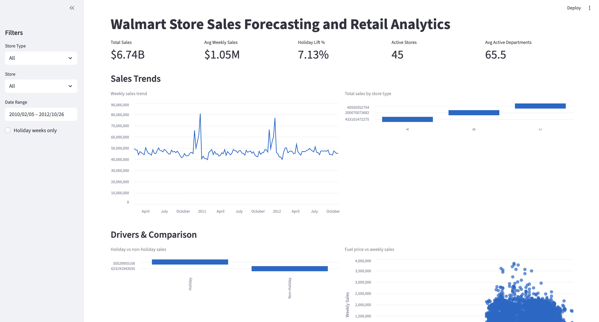

# Walmart Store Sales Forecasting & Retail Analytics in Snowflake

An end-to-end analytics portfolio project built with **Snowflake SQL**, **Python**, and **Streamlit** to analyze Walmart store and department sales using the Kaggle Walmart Recruiting dataset. The project demonstrates a production-style analytics workflow from raw ingestion to business-ready reporting and dashboard delivery.

---

## Project Summary

This project was designed to answer a practical retail analytics question: how do weekly sales vary across Walmart stores and departments, what factors influence those changes, and how can those patterns support better planning?

The solution includes:

- Snowflake data warehouse design with **RAW**, **STAGING**, **MARTS**, and **REPORTING** layers
- SQL transformations for data cleaning, typing, deduplication, and fact/dimension modeling
- Reporting views for analytics consumption
- A Streamlit portfolio dashboard connected directly to Snowflake
- Optional Python notebooks for EDA, data quality, and forecasting extensions

---

## Business Problem

Retail teams need visibility into weekly sales performance to make better decisions around inventory, staffing, promotions, and seasonal planning. Sales are affected not only by store and department behavior, but also by holidays, temperature, fuel prices, markdowns, and macroeconomic variables such as CPI and unemployment.

This project explores:

- How sales differ across store types and departments
- Whether holiday weeks produce measurable sales lift
- How store-level external features relate to weekly sales performance
- How analytics-ready data models can support both reporting and future forecasting work

---

## Dataset

Source: **Walmart Recruiting — Store Sales Forecasting** on Kaggle.

| File | Description | Grain |
|------|-------------|-------|
| `train.csv` | Historical weekly sales | Store + Dept + Date |
| `test.csv` | Holdout periods without target sales | Store + Dept + Date |
| `features.csv` | Temperature, fuel price, markdowns, CPI, unemployment, holiday flag | Store + Date |
| `stores.csv` | Store type and store size | Store |

> CSV source files are downloaded locally from Kaggle and excluded from Git with `.gitignore`.

---

## Tech Stack

| Category | Tools |
|----------|-------|
| Data warehouse | Snowflake |
| SQL | Snowflake SQL, CTAS, views, window functions |
| Python | pandas, NumPy |
| Dashboard | Streamlit |
| Connectivity | snowflake-connector-python |
| Notebooks | Jupyter |
| Forecasting | scikit-learn, statsmodels (optional extension) |
| Version control | Git, GitHub |

---

## Architecture

```text
Kaggle CSVs
    ↓
RAW
    ↓
STAGING
    ↓
MARTS
    ↓
REPORTING
    ↓
Streamlit Dashboard / SQL Analysis / Notebook Exploration
```

### Snowflake layers

| Schema | Purpose | Key Objects |
|--------|---------|-------------|
| `RAW` | Landing zone that mirrors source CSV structure | `TRAIN`, `TEST`, `FEATURES`, `STORES` |
| `STAGING` | Cleaned and standardized layer with typed fields and deduplication | `STG_TRAIN`, `STG_TEST`, `STG_FEATURES`, `STG_STORES` |
| `MARTS` | Business-ready dimensional layer for analytics | `DIM_STORE`, `FACT_SALES`, `FACT_STORE_FEATURES`, `FACT_STORE_WEEKLY_SALES` |
| `REPORTING` | Thin consumption views for dashboarding and SQL demos | `VW_SALES_SUMMARY`, `VW_HOLIDAY_IMPACT`, `VW_TOP_DEPARTMENTS`, `VW_STORE_WEEK_METRICS` |

Warehouse used: `WALMART_WH`.

---

## Data Pipeline

The SQL pipeline is implemented as numbered scripts and executed in order:

1. `01_create_database.sql` — creates the database, schemas, and warehouse
2. `02_create_raw_tables.sql` — creates RAW landing tables
3. `03_load_data.sql` — loads staged CSV data into RAW tables
4. `04_create_staging.sql` — standardizes and cleans source data in STAGING
5. `05_create_marts.sql` — builds dimensional and fact tables in MARTS
6. `06_window_functions.sql` — demonstrates analytical SQL patterns
7. `07_reporting_views.sql` — exposes reporting-friendly dashboard views
8. `08_data_quality_checks.sql` — validates RAW, STAGING, and MARTS outputs

---

## Dashboard

The Streamlit dashboard connects to Snowflake reporting views and provides interactive exploration of sales performance.

### Dashboard features

- Sidebar filters for store type, store, date range, and holiday-only analysis
- KPI cards for total sales, average weekly sales, holiday lift, active stores, and active departments
- Weekly sales trend visualization
- Sales comparison by store type
- Holiday vs non-holiday comparison
- Scatter plots for temperature vs sales and fuel price vs sales
- Top departments by store table
- Detailed store-week operational metrics

### Dashboard Preview

**Overview**


**Operational detail**


---

## Key Insights

Based on the current dashboard output:

- Holiday weeks show a measurable sales lift, with average department sales approximately **7.13% higher** than non-holiday weeks.
- The dashboard currently summarizes sales across **45 active stores**.
- Average weekly sales are approximately **$1.05M** across the selected default view.
- Store type comparisons show clear differences in total sales contribution, which supports segmentation analysis by store format.
- External factors such as temperature and fuel price can be explored visually against weekly sales at the store-week level.

---

## SQL Analysis Highlights

The project includes SQL examples beyond ETL:

- Moving averages to smooth weekly volatility
- `LAG` and `LEAD` for week-over-week comparison
- Ranking logic for top departments within each store
- Holiday performance analysis
- Store-week rollups for dashboard use

---

## Repository Structure

```text
├── README.md
├── .gitignore
├── requirements.txt
├── sql/
│   ├── 01_create_database.sql
│   ├── 02_create_raw_tables.sql
│   ├── 03_load_data.sql
│   ├── 04_create_staging.sql
│   ├── 05_create_marts.sql
│   ├── 06_window_functions.sql
│   ├── 07_reporting_views.sql
│   └── 08_data_quality_checks.sql
├── notebooks/
│   ├── 01_eda.ipynb
│   ├── 02_forecasting.ipynb
│   └── 03_data_quality.ipynb
└── app/
    └── streamlit_app.py
```

---

## How to Run

### 1. Set up Python

```bash
python -m venv .venv
source .venv/bin/activate
pip install -r requirements.txt
```

### 2. Download the Kaggle data

Download these files locally:

- `train.csv`
- `test.csv`
- `features.csv`
- `stores.csv`

### 3. Execute Snowflake SQL scripts

Run the SQL files in the pipeline order listed above.

### 4. Configure Streamlit secrets

Create `.streamlit/secrets.toml`:

```toml
[snowflake]
user = "YOUR_USER"
password = "YOUR_PASSWORD"
account = "YOUR_ACCOUNT_IDENTIFIER"
```

### 5. Launch the dashboard

```bash
streamlit run app/streamlit_app.py
```

---

## What This Project Demonstrates

This project demonstrates practical skills in:

- Data warehousing in Snowflake
- ELT pipeline design
- SQL-based dimensional modeling
- Reporting-layer design for analytics consumption
- Window functions for business analysis
- Python-to-Snowflake integration
- Building a portfolio-ready analytical dashboard

---

## Next Improvements

Potential extensions for the project:

- Add README screenshots and architecture diagram
- Add baseline forecasting models in the forecasting notebook
- Expand insight documentation with written business commentary
- Deploy the Streamlit dashboard publicly
- Add automated testing or validation checks for the SQL pipeline

---

## License & Attribution

Dataset: **Walmart Recruiting — Store Sales Forecasting** from Kaggle.

This project is intended for educational and portfolio purposes.
